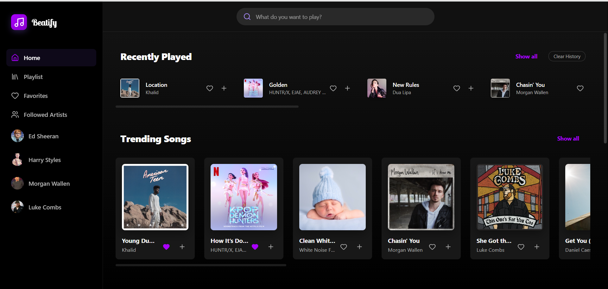
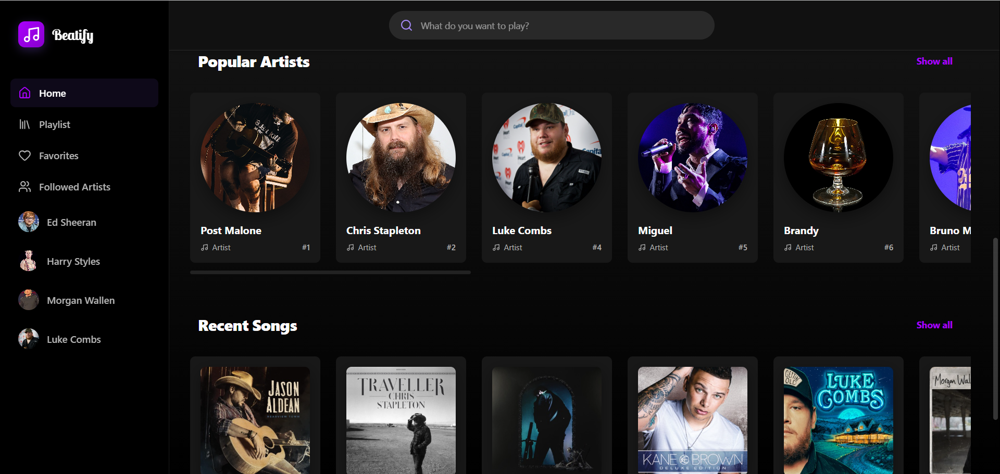
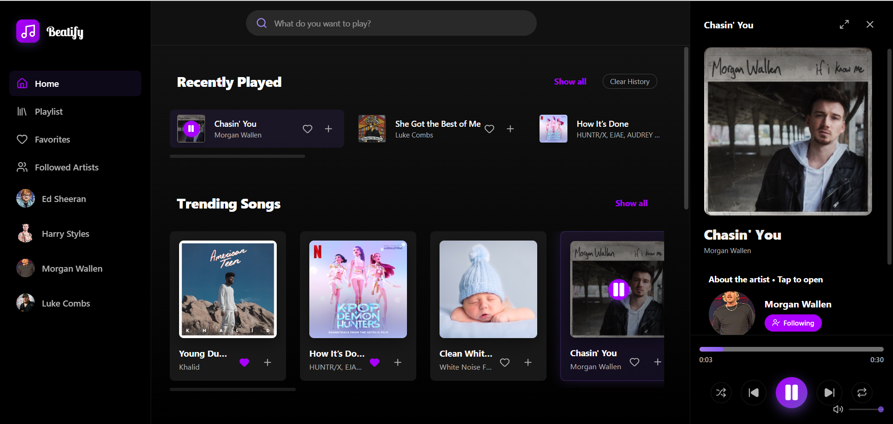
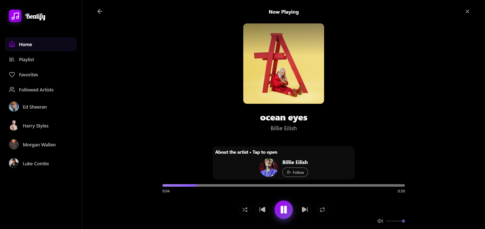
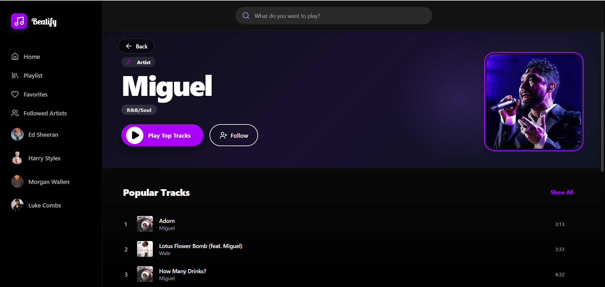
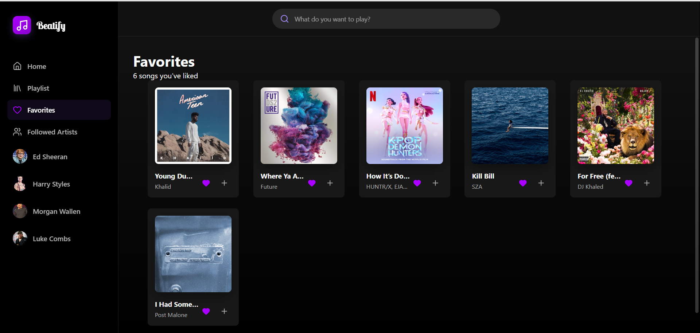
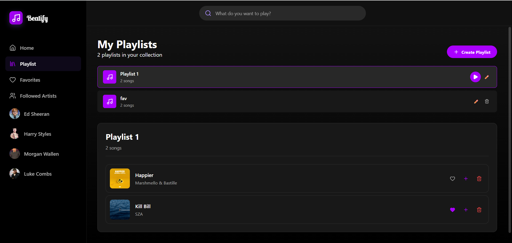

# Beatify 🎵 — Music Streaming App

A modern music streaming application built with React, Vite, and Express. Features include:

- 🎵 Music streaming with iTunes API integration
- 🎨 Beautiful, responsive UI with Framer Motion animations
- 📱 Mobile-friendly design
- 🎯 Enhanced rate limiting and caching
- 📝 Recently played tracks tracking
- ⭐ Favorites and playlist management
- 🔍 Search functionality
- 🎧 Audio player with controls

## Screenshots

<div align="center">
  
  
</div>
<br/>
<div align="center">
  
  
</div>
<br/>
<div align="center">
  
  
</div>
<br/>
<div align="center">
  
</div>

## Tech Stack

- **Frontend**: React 18, Vite, Framer Motion, Lucide React
- **Backend**: Express.js, Node.js
- **API**: iTunes Search API
- **Styling**: CSS with custom properties

## Getting Started

### Prerequisites
- Node.js **v18 or higher**
- npm

### Installation

1. Clone the repository:
   ```bash
   git clone https://github.com/YOUR_USERNAME/music-app.git
   cd music-app
   ```

2. Install dependencies:
   ```bash
   npm install
   ```

3. Set up environment variables:
   ```bash
   # Copy the example env file
   copy .env.example .env   # Windows
   cp .env.example .env     # Mac/Linux
   ```
   The default values in `.env` work for local development out of the box.

### Development

The app requires **two servers** running simultaneously. Open two terminals:

**Terminal 1 — Backend API server:**
```bash
npm run server
# Runs on http://localhost:5000
```

**Terminal 2 — Frontend dev server:**
```bash
npm run dev
# Runs on http://localhost:5173
```

Then open [http://localhost:5173](http://localhost:5173) in your browser.

### Available Scripts

| Command | Description |
|---------|-------------|
| `npm run dev` | Start frontend development server |
| `npm run server` | Start backend API server |
| `npm run build` | Build frontend for production |
| `npm run preview` | Preview production build locally |
| `npm run lint` | Run ESLint |

## Environment Variables

| Variable | Default | Description |
|----------|---------|-------------|
| `VITE_API_BASE_URL` | `http://localhost:5000` | Backend API URL (change for production) |
| `PORT` | `5000` | Backend server port |
| `CORS_ORIGIN` | `http://localhost:5173` | Allowed frontend origin (change for production) |

## Features

### Music Streaming
- Stream preview tracks from iTunes API
- Search for songs, artists, and albums
- Browse trending tracks and popular artists
- View artist profiles and discographies

### User Experience
- Recently played tracking with persistent storage
- Favorites management
- Playlist creation and management
- Responsive design for all devices
- Smooth animations and transitions

### Technical Features
- Enhanced rate limiting to comply with API limits
- Response caching for improved performance
- Request queuing with priority handling
- Error handling with fallback to demo data
- Client-side rate limit awareness

## API Endpoints

| Endpoint | Description |
|----------|-------------|
| `GET /api/chart/tracks` | Get trending tracks |
| `GET /api/chart/artists` | Get popular artists |
| `GET /api/chart/albums` | Get top albums |
| `GET /api/search/tracks?q={query}` | Search tracks |
| `GET /api/artist/{id}` | Get artist details + top songs |
| `GET /api/artist/{id}/albums` | Get artist albums |

## Production Deployment

When deploying, set these environment variables on your hosting platform:

```
VITE_API_BASE_URL=https://your-backend-url.com
CORS_ORIGIN=https://your-frontend-url.com
NODE_ENV=production
```

## Contributing

1. Fork the repository
2. Create a feature branch (`git checkout -b feature/my-feature`)
3. Make your changes
4. Submit a pull request

## License

This project is licensed under the MIT License.
